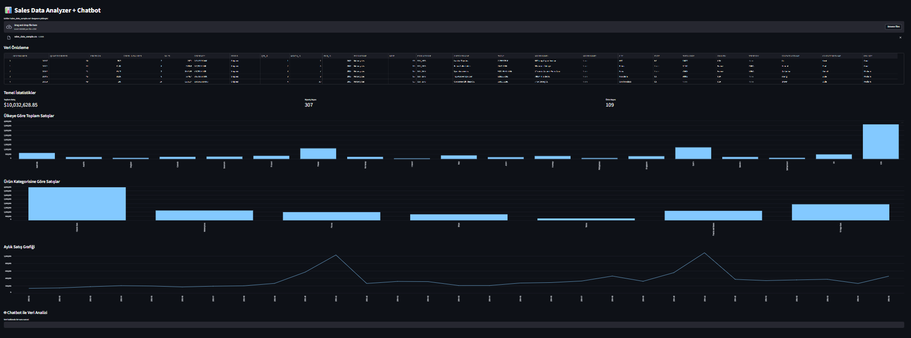
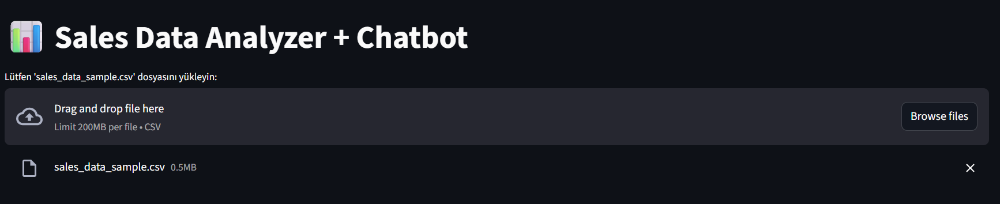
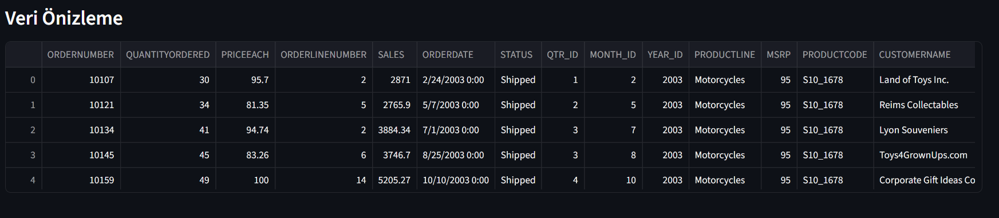
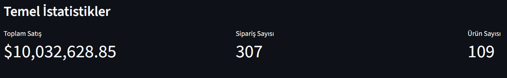
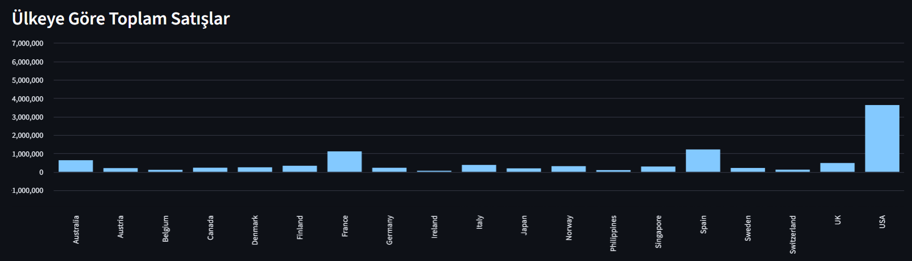
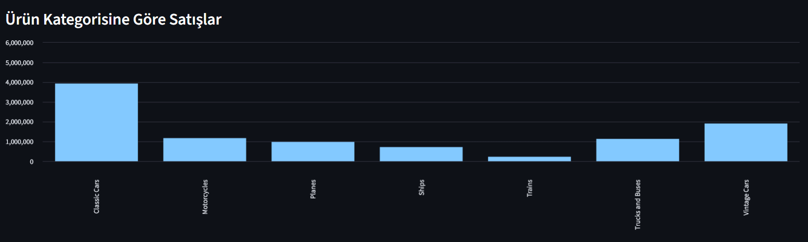
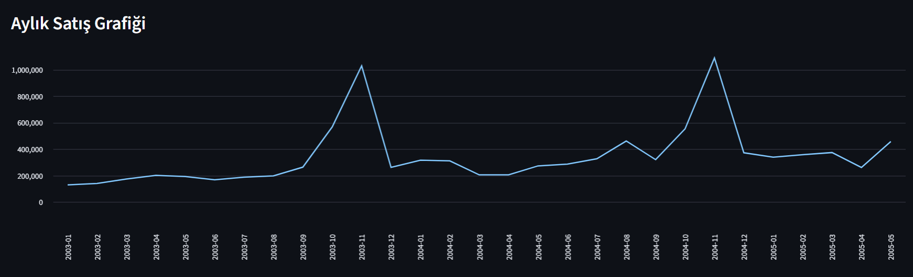
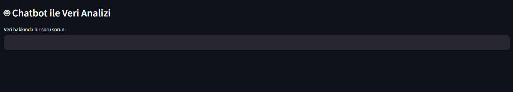

# Sales Data Analyzer + Chatbot

CSV formatındaki satış verilerini yükleyerek otomatik grafikler oluşturan ve OpenAI GPT-4 destekli chatbot aracılığıyla veriler hakkında doğal dilde soru sormanıza olanak tanıyan interaktif bir veri analiz uygulaması.

---

## Genel Bakış



Uygulama tek sayfalık bir Streamlit arayüzünde çalışır. CSV dosyasını yükledikten sonra otomatik olarak temel istatistikler, grafikler ve chatbot bölümü görünür hale gelir.

---

## Özellikler

- **CSV Veri Yükleme** — Drag & drop veya dosya seçici ile kolay veri yükleme
- **Veri Önizleme** — Yüklenen verinin ilk satırlarını tablo halinde görüntüleme
- **Temel İstatistikler** — Toplam satış, sipariş sayısı ve ürün sayısı kartları
- **Ülkeye Göre Satış Grafiği** — Ülkeler bazında satış dağılımı
- **Kategoriye Göre Satış Grafiği** — Ürün kategorileri bazında satış dağılımı
- **Aylık Satış Trendi** — Zaman serisi çizgi grafiği
- **GPT-4 Chatbot** — Veri hakkında doğal dilde soru sorma

---

## Teknolojiler

| Teknoloji | Kullanım Amacı |
|-----------|----------------|
| Python | Ana programlama dili |
| Streamlit | Web arayüzü |
| Pandas | Veri işleme ve analiz |
| OpenAI GPT-4 | Doğal dil işleme / chatbot |

---

## Kurulum

### Gereksinimler

- Python 3.8+
- OpenAI API anahtarı

### Adım 1 — Repoyu klonla

```bash
git clone https://github.com/TahirAytekin/DATA_GPT.git
cd DATA_GPT
```

### Adım 2 — Bağımlılıkları yükle

```bash
pip install streamlit pandas openai
```

### Adım 3 — API anahtarını tanımla

Proje dizininde `.streamlit/secrets.toml` dosyası oluştur:

```toml
OPENAI_API_KEY = "sk-..."
```

### Adım 4 — Uygulamayı çalıştır

```bash
streamlit run DATAGPT2.py
```

Tarayıcıda `http://localhost:8501` adresinde açılır.

---

## Kullanım Kılavuzu

### 1. Dosya Yükleme



Uygulama açıldığında bir CSV yükleme alanı görürsünüz. `sales_data_sample.csv` formatında bir dosya sürükleyip bırakın veya **Browse files** butonuna tıklayın. Maksimum dosya boyutu 200 MB'tır.

---

### 2. Veri Önizleme



Dosya yüklendikten sonra verinin ilk 5 satırı tablo halinde görüntülenir. Bu ekranda sütun adlarını ve veri tiplerini doğrulayabilirsiniz. Uygulama şu sütunları bekler:

| Sütun | Açıklama |
|-------|----------|
| `ORDERNUMBER` | Sipariş numarası |
| `QUANTITYORDERED` | Sipariş edilen adet |
| `PRICEEACH` | Birim fiyat |
| `SALES` | Toplam satış tutarı |
| `ORDERDATE` | Sipariş tarihi |
| `STATUS` | Sipariş durumu |
| `PRODUCTLINE` | Ürün kategorisi |
| `CUSTOMERNAME` | Müşteri adı |
| `COUNTRY` | Ülke |

---

### 3. Temel İstatistikler



Yüklenen veriye ait üç ana metrik otomatik olarak hesaplanır:

- **Toplam Satış** — Tüm siparişlerin toplam tutarı
- **Sipariş Sayısı** — Benzersiz sipariş adedi
- **Ürün Sayısı** — Benzersiz ürün adedi

---

### 4. Ülkeye Göre Toplam Satışlar



Her ülkenin toplam satış tutarı bar grafik olarak gösterilir. Grafikte ülkeler alfabetik sırada listelenir. Örnek veride ABD en yüksek satışa sahip ülkedir (~3.5M).

---

### 5. Ürün Kategorisine Göre Satışlar



`PRODUCTLINE` sütununa göre gruplanan satışlar bar grafik olarak görselleştirilir. Örnek veride **Classic Cars** kategorisi ~4M ile açık ara öndedir.

---

### 6. Aylık Satış Grafiği



Tarih bazlı çizgi grafiği ile satış trendini zaman içinde takip edebilirsiniz. Grafik, yıl-ay bazında satışların nasıl değiştiğini gösterir ve mevsimsel dalgalanmaları tespit etmek için kullanılabilir.

---

### 7. Chatbot ile Veri Analizi



Sayfanın alt bölümünde yer alan chatbot sayesinde veriler hakkında doğal dilde sorular sorabilirsiniz. Chatbot, GPT-4 modeli ile çalışır ve veri yapısını bağlam olarak kullanarak yanıt üretir.

**Örnek sorular:**
- *"En çok satış yapılan ülke hangisi?"*
- *"Classic Cars kategorisinin toplam satışı ne kadar?"*
- *"2004 yılındaki en yüksek satış hangi aydaydı?"*
- *"Shipped durumundaki siparişlerin oranı nedir?"*

---

## Proje Yapısı

```
DATA_GPT/
├── DATAGPT2.py          # Ana uygulama dosyası
├── screenshots/         # Uygulama ekran görüntüleri
├── asset/               # Ek görseller
├── .gitignore
├── LICENSE
└── README.md
```

---

## Lisans

MIT License — Detaylar için [LICENSE](LICENSE) dosyasına bakın.
